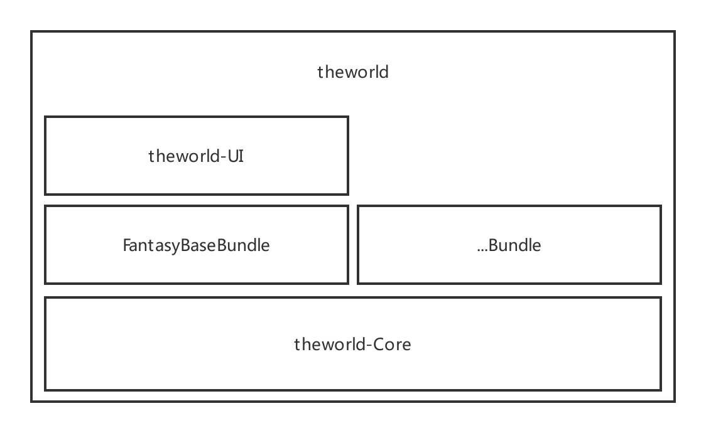
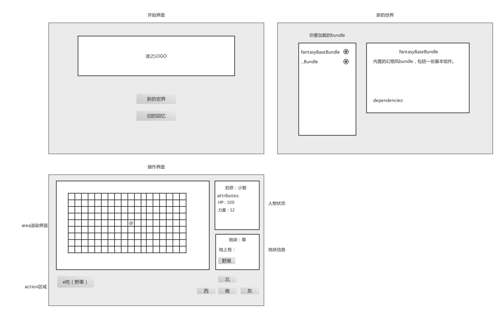

# MVP Design Documentation
This document is Software_Design_Description for 'theworld' project's MVP version. Includes

## Project Component

the project has three parts in the mvp version.

* **Core**. the basic logic and framework of the project. Which also provide the extension mechanism called "bundle".
* **FantasyBaseBundle**. the native bundle written by the core team for shows the power of the framework.
* **theworld-UI**. the electron app for display the game content, which can be rewrite by other developer.

## Core
Core层是整个游戏框架的逻辑所在，其核心是world对象，整个游戏框架存在几个基本概念time，area，creature，item。同时core提供了基本扩展方式bundle。

### World
world是这整个框架的入口，包括了游戏的加载，运行，存储。
```Typescript
import { World } from '@theworld/core'
const world = new World("./myworld")
await world.load()
await world.run(4434) // game process port
```

World这个class包含的方法如下
```Typescript
interface World {
    load: () => Promise<void> // 加载世界数据
    run: () => Promise<void> //  运行世界，参看【world的运行机制】一节
}
```

### Game
对于theworld框架中的游戏部分，有几个基本概念[time时间机制](../game/time.md)，[地图机制](../game/map-mechanism.md)，[creature]](../game/creature.md)，[item]](../game/item.md)，[action]](../game/action.md)。

同时需要了解的是框架中关于[GameWorld](../game/game-world.md)以及[Bundle](../game/bundle.md)的概念


### theworld-UI
theworld-UI层是游戏的画面渲染层，为一个electron应用，应用的启动会开启两个进程，一个是引用core包开启的游戏进程，另一个是展示用的渲染进程。

其UI原型图如下。

