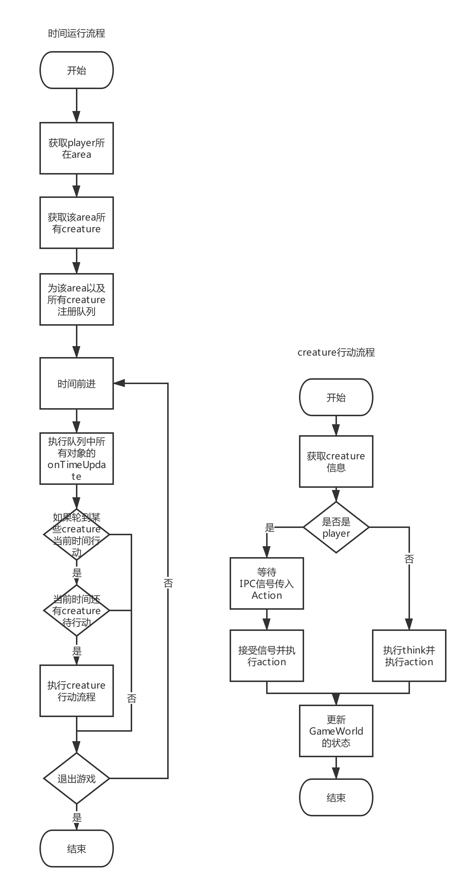

# GameWorld
GameWorld是theworld框架中游戏逻辑最为核心的对象，

## Top-Level API
```Typescript
interface GameWorld {
    getArea: (areaId: string) => Area
    getItem: (itemId: string) => Item
    getCreature: (creatureId: string) => Creature
    // 时间前进，回合制得执行所有creature，area，item的逻辑，调用各种onTimeUpdate。
    run: () => void
    // applyWorldUpdates用于更新整个游戏世界状态的API，是事务的，有一个异常则回滚全部
    applyWorldUpdates: (result: WorldUpdate) => void
}

// WorldUpdate用于各种东西想更新任何的东西所产生的变更，类似redux的reducer。
interface WorldUpdate {
    type: EResultType,
    payload: any,
}

```


## WorldUpdate
WorldUpdate是theworld中类似redux中reducer的概念，theworld中所有的数据像是一个全局的状态，而WorldUpdate则是用来描述各种行为对这一全局状态的影响。

其中WorldUpdate的分类暂定如下

### Message
Message类型的Update主要是为了更新游戏内的通知，直接通知。
```Typescript
type MessageUpdate = {
    type: "message",
    payload: {
        template: string;
        [key: string]: any;
    }
}
const update = {
    type: "message",
    payload: {
        // this format is for i18n
        template: "you gain ${payload.exp}"
        exp: 26
    }
}
```

### CreatureChange
对于Creature的更新，类似setState
```Typescript
type CreatureChangeUpdate = {
    type: "creature-change",
    payload: {
        id: string;
        name?: string;
        description?: string;
        gender?: ECreatureGender;
        race?: string;
        equipment?: {
            [bodyPart: string]: string | null;
        },
        state?: string;
        position?: {
            areaId: string;
            x: number;
            y: number;
            direction: EDirection;
        },
        meta?: {
            [metaKey]: any;
        },
        // change for skills
        skillsChange?: {
            [skillId]: {
                addExp: number
            };
        }
        // change for inventory
        inventoryChange?: {
            lose?: Array<string>, // itemId of item which will get lost
            add?: Array<string>, // itemId of item which will be added
            addMax?: number,
            decreaseMax?: number
        }
        // change for effect
        // no effect right now
        // change for attributes base
        attributesChange: {
            [attributeKey]: {
                baseAdd?: number
                baseDecrease?: number
            }
        }
    }
}
```

### AreaChange
对于Area的更新，类似setState
```Typescript
type AreaChangeUpdate = {
    type: "area-change",
    payload: {
        id: string;
        name?: string,
        mapChange?: Array<{
            x: number,
            y: number,
            newTile: Tile,
        }>,
        creaturesChange: {
            remove: Array<Creature>,
            add: Array<Creature>,
        },
        itemsChange: {
            remove: Array<Item>,
            add: Array<Item>,
        },
        meta?: {
            [metaKey]: any;
        },
    }
}
```

### ItemChange
暂无

## UpdateMiddleware
暂无


## GameWorld的运行机制
GameWorld中run方法主要流程图如下



## GameWorld的状态更新
GameWorld的数据持久化的存储在文件中，项目底层使用nedb作为数据库管理工具用来做数据的检索以及存储。对外只暴露applyWorldUpdates
