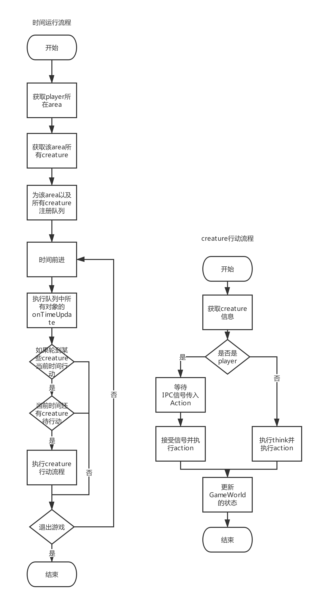

# 时间机制
在theworld框架中有时间这一基本概念，同时整个世界的演进以及人物的行为都是通过时间作为标准的，机制参考elona的伪实时的回合制。

具体的来说是这样的：

1. 每个回合都会先更新环境
2. 每个回合先是对非玩家的creature做行为判断，改变世界状态
3. 最后等待player，即用户操作，如果没有操作，则会堵塞，直到用户进行操作才会进入下一个回合

<!-- ## 时间维度
1天为86400单位个时间，（也可以理解为以秒为1单位时间） -->

## 时间的作用
用于更新Creature身上的Effect、演进时间。

## 时间机制的实现
在框架中，时间由GameWorld对象保存，同时一切时间前进的逻辑都是在GameWorld中去完成的



#### 类型

```Typescript

type ActionCommand = {
    actionId: string;
    target: Creature | Item | Tile;
};

```

#### GameWorld方法

```Typescript
interface GameWorld {
    // ...
    static MAX_UPDATES_TIME: number // applyWorldUpdates最大次数，因为涉及到回滚，回滚也使用该方法，所以如果回滚失败可能会导致死循环，给个最大次数
    static MAX_ROUND: number // 回合数，这里考虑为Number.MAX_SAFE_INTEGER
    // 时间前进，回合制得执行所有creature，area，item的逻辑，调用各种onTimeUpdate。
    run: () => void
    private loopOnce: () => Promise<void>

    // applyWorldUpdates用于更新整个游戏世界状态的API，是事务的，有一个异常则回滚全部
    applyWorldUpdates: (updates: WorldUpdate[]) => void
    applyWorldUpdate: (updates: WorldUpdate) => void

    // 更新当前区域状态
    private updateCurrentArea: (curArea: Area, creatures: Creature[], player: Creature) => Promise<void>
    // 更新非当前区域状态
    private updateIdleAreas: (idleAreas: Area[], player: Creature)=> Promise<void>
    // 更新当前区域非player生物
    private updateCreatures: (creatures: Creature[], player: Creature, area: Area) => Promise<void>
    // 更新玩家状态
    updatePlayer: (player: Creature, area: Area) => Promise<void>
    // 获取外部信号量，用于更新玩家状态
    getSignal: (player: Creature, area: Area) => ActionCommand
}
